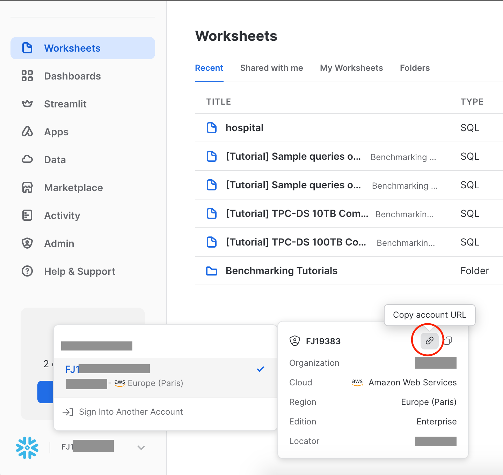
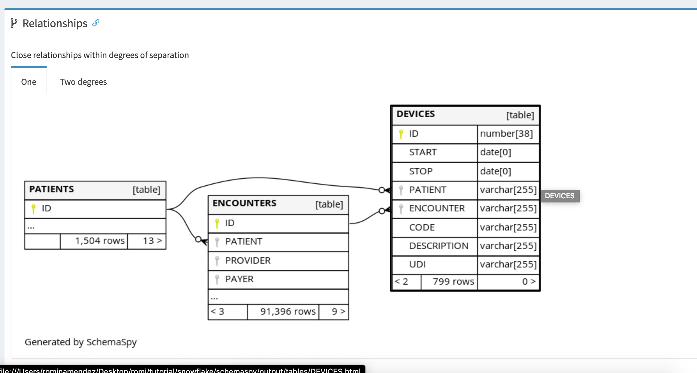
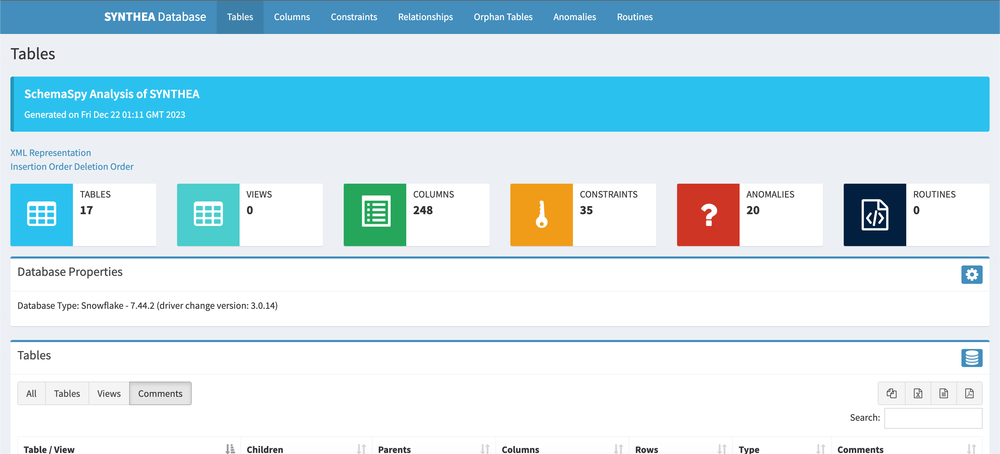

# ❄️Snowflake SchemaSpy  🐳 Docker Compose

## Overview

This project sets up a Docker Compose environment for utilizing [SchemaSpy](https://schemaspy.org/) with [Snowflake](https://www.snowflake.com/es/). 

* [SchemaSpy](https://schemaspy.org/) is a tool that generates an HTML representation of a database schema's relationships, providing insights into the database structure.

* [Snowflake](https://www.snowflake.com/es/) is a cloud-based data storage and processing service that provides a highly scalable and fully managed data storage environment. Its architecture is built on the separation of storage and computing, allowing elastic scalability and optimal performance.


## 🚀 Benefits of SchemaSpy
* Visual representation of the database schema.
* Relationship insights between tables.
* HTML report for easy sharing and documentation.


---

## Prerequisites

Before you begin, ensure that you have the following installed on your machine:

- Docker
- Docker Compose

# Usage

## Clone this repository

   ```bash
   git clone https://github.com/r0mymendez/schemaspy-snowflake.git
   cd schemaspy-snowflake
   ```
## Snowflake Configuration
Ensure that your Snowflake configuration (config/snowflake.properties) includes the necessary connection details such as account, role, warehouse, and database.
For this reason replace `your_user`, `your_password`, `your_account`, `your_role,` `your_warehouse`, and `your_database `with your Snowflake credentials.

```bash
schemaspy.t=snowflake
schemaspy.u=<user>
schemaspy.p=<password>
schemaspy.account=<account>
schemaspy.role=<role
schemaspy.warehouse=<warehouse>
schemaspy.db=<database>
schemaspy.s=<schema>
```

### Account 
Below is an example of an account URL. However, you only need to use a portion of it in the configuration:

* Full account URL: https://nl1111.eu-west-3.aws.snowflakecomputing.com
* Account to use in the configuration: nl1111.eu-west-3.aws




## Build and run the Docker Compose environment
This command will build the Docker images and start the containers.

```bash
docker-compose -f docker-compose-snowflake.yaml up
```

---

# Schemapy
Upon executing Docker Compose, you can obtain our entire web page in the output folder (? unsure if it should be phrased this way). This page includes several tabs with the following functionalities:

## Functionality Tabs
* **Tables:** Provides an overview of all tables in the database schema.
* **Columns:** Displays detailed information about columns within each table.
* **Constraints:** Offers insights into constraints applied to the database.
* **Relationships:** Visualizes the relationships between different tables.
* **Orphan Tables:** Identifies tables without established relationships.
* **Anomalies:** Highlights any irregularities or anomalies in the schema.
* **Routines:** Presents information about stored routines or procedures.

## Accessing Example

In the provided example, we showcase a demo utilizing a synthetic database called Synthea. Synthea is a state-of-the-art synthetic data generation tool designed for creating realistic, yet entirely fictitious, patient records and healthcare data. It enables the simulation of diverse medical scenarios, making it a valuable resource for testing and development purposes in the healthcare domain.
Visit the following [link to access a demo](https://r0mymendez.github.io/schemaspy-snowflake). 



